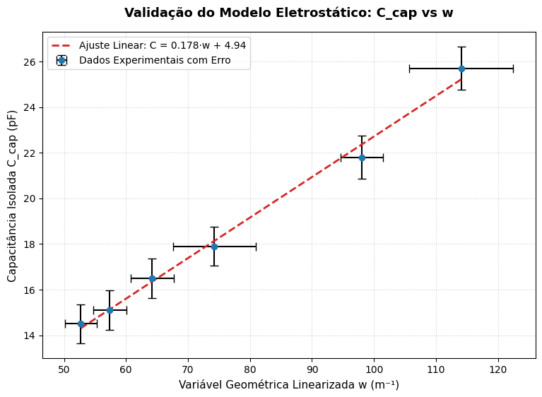
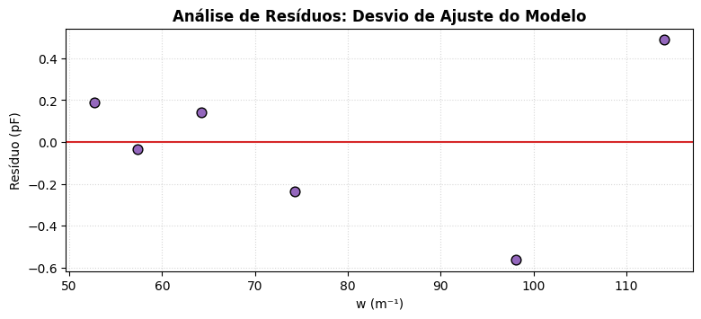

\# ⚡ ETL & Modelagem Estatística: Validação de Permissividade Eletrostática

# ⚡ ETL & Modelagem Estatística: Validação Eletrostática


Um pipeline de dados de ponta a ponta construído para ingerir, limpar e modelar dados ruidosos de sensores de laboratório. O projeto automatiza o tratamento de incertezas experimentais e aplica regressão linear com pesos para extrair constantes físicas a partir de variáveis geométricas.

---

## 📸 Dashboards e Observabilidade

<div align="center">
  
  
</div>

---

## 🎯 O Desafio
Em ambientes de laboratório, medições brutas carregam ruídos de instrumentação (ex: capacitância residual de cabos) e erros humanos na operação de paquímetros. O objetivo desta arquitetura é:
1. Isolar o sinal real do componente.
2. Propagar incertezas estatísticas através de derivadas parciais.
3. Validar a lei das placas paralelas extraindo a constante de permissividade do ar ($\epsilon_0$) via modelagem computacional.

## 🏗️ Arquitetura do Pipeline (ETL)

O motor de cálculo foi modularizado, separando as regras de negócio da camada de apresentação:

* **Extract:** Ingestão do dataset bruto (`capacitor_data.csv`) via Pandas, tratando delimitações de formato regional.
* **Transform:** * Engenharia de features: Linearização da variável de distância ($w = 1000/d$).
  * Tratamento de ruído: Subtração contínua da capacitância residual.
  * Estatística Aplicada: Cálculo de desvio padrão amostral e propagação multivariável de incertezas independentes.
* **Model:** Ajuste linear utilizando a matriz de covariância (`NumPy polyfit`), ponderando os pontos experimentais pelo inverso de suas variâncias.
* **Load:** Mascaramento de algarismos significativos e exportação do dataset final enriquecido (`capacitor_processado.csv`).

## 🗂️ Estrutura do Projeto

```text
projeto-analise-eletro/
├── data/
│   ├── capacitor_data.csv          # Dataset bruto (Input)
│   └── capacitor_processado.csv    # Dataset limpo e arredondado (Output)
├── scripts/
│   └── calculos.py                 # Módulo central de regras de negócio e matemática
├── analise.ipynb                   # Notebook de orquestração e visualização
└── README.md